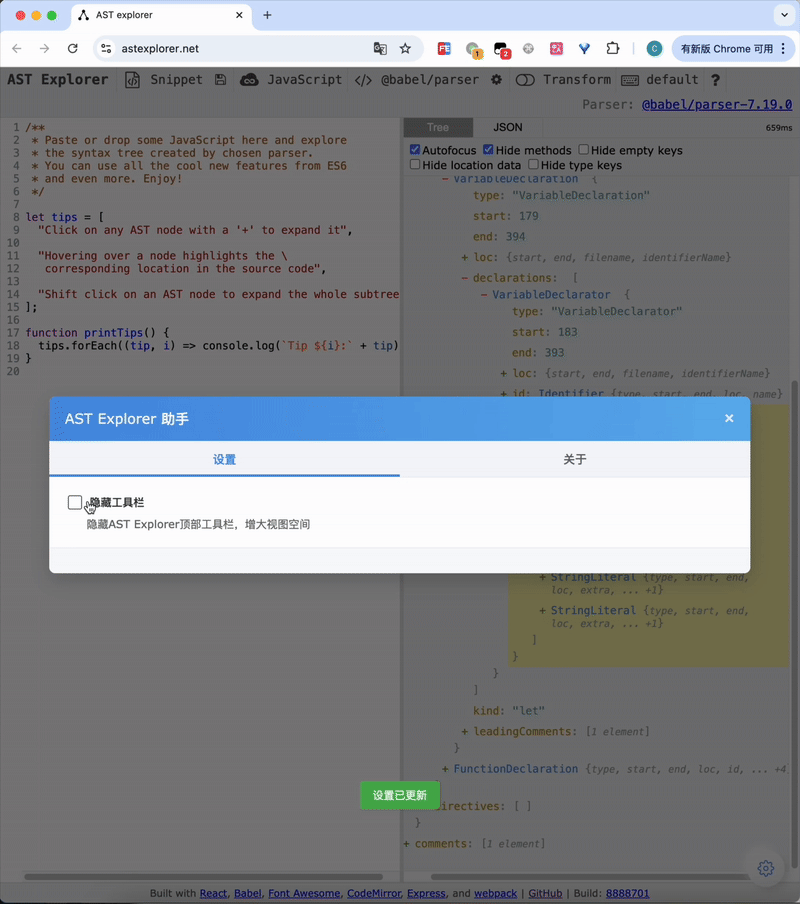

# AST Explorer Helper 🎯

English | [简体中文](./README.md)

A simple and practical browser plugin to enhance the user experience of the [AST Explorer](https://astexplorer.net/) website.

[](https://github.com/JSREI/ast-explorer-helper/stargazers)
[](https://github.com/JSREI/ast-explorer-helper/network)
[](https://github.com/JSREI/ast-explorer-helper/blob/main/LICENSE)
[](https://github.com/JSREI/ast-explorer-helper/issues)
[](https://greasyfork.org/en/scripts/419783-ast-explorer-helper)
[](https://www.typescriptlang.org/)
[](https://www.tampermonkey.net/)

🌐 [Official Website](https://jsrei.github.io/ast-explorer-helper/) | [Greasy Fork](https://greasyfork.org/en/scripts/419783-ast-explorer-helper) | [GitHub](https://github.com/JSREI/ast-explorer-helper)

## ✨ Key Features

### Hide Toolbar

Ability to hide the toolbar, increasing view space for a more comfortable code analysis experience.

<p align="center">
  
</p>

### Right-Click Copy

Support for quickly copying node content via the right-click menu, with simple and intuitive operation, preserving the original format.

<p align="center">
  
</p>

## 🛠️ Technical Implementation

- **TypeScript**: Provides type-safe code implementation
- **Userscript**: Implements browser-side feature injection
- **Modular Design**: Clear code structure for easy maintenance and extension

## 📦 Installation Methods

### Method 1: Install from Userscript Store (Recommended)

1. First install a userscript manager
   - Chrome/Edge users: Install [Tampermonkey](https://www.tampermonkey.net/)
   - Firefox users: Install [Greasemonkey](https://addons.mozilla.org/en-US/firefox/addon/greasemonkey/)

2. Install this userscript
   - Click [here](https://greasyfork.org/en/scripts/419783-ast-explorer-helper) to install the script

### Method 2: Compile and Install Yourself

1. Clone the repository
```bash
git clone https://github.com/JSREI/ast-explorer-helper.git
```

2. Install dependencies
```bash
npm install
```

3. Build the project
```bash
npm run build
```

4. Find the `ast-explorer-helper.user.js` file in the dist directory and drag it to your userscript manager page to install

## 💻 Development Guide

### Environment Setup
```bash
# Install dependencies
npm install
```

### Development Mode
```bash
# Start the development server with hot reload
npm run watch
```

### Build Release Version
```bash
# Generate production code
npm run build
```

## 📝 License

MIT License

## 🙏 Acknowledgements

This project is based on [TypeScript UserScript Template](https://github.com/JSREI/typescript-userscript-template), thanks to the template for providing the basic development framework.

## 👨‍💻 Contributors

Thanks to the following users for reporting issues and suggesting improvements, helping us to continuously enhance the product:

- [@mazp99](https://github.com/mazp99) - Suggested the code block copy feature

## 💬 Reverse Engineering Community

### WeChat

Scan the QR code to join the reverse engineering WeChat group:


If the group QR code expires, you can add my personal WeChat and send [Reverse Group] to join:


### QQ

[Click here](https://qm.qq.com/q/YfdB3w3OEY) to scan and join the QQ group:


### Telegram 

[Click here](https://t.me/jsreijsrei) or scan to join the Telegram group:


## 📈 Star History

[](https://star-history.com/#JSREI/ast-explorer-helper&Date) 